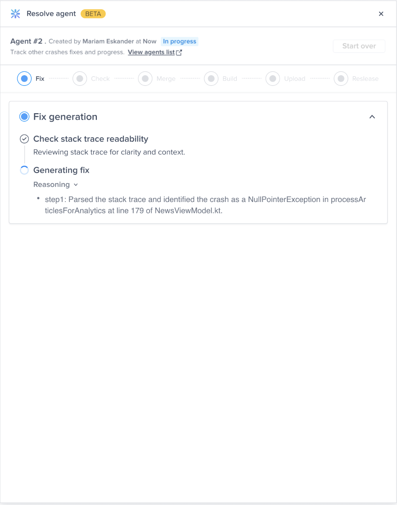

# Welcome Message

### Setting the Welcome Message Mode

By default, a welcome message that explains how to [show Luciq](../../setup-bug-reporting/showing-luciq.md) will be shown to your app users within 10 seconds of starting their first session after the SDK is integrated. The welcome mode can be set to live, beta, or disabled using the method below. The default welcome mode is set to live.

The popups that appear follow the [color theme](ui-color-and-theme.md) and [primary color](ui-color-and-theme.md#setting-the-primary-color) that you set for the SDK.

You can also edit the content of the message using the method and keys found in the [Locale](sdk-locale.md) page.


```dart
Luciq.setWelcomeMessageMode(WelcomeMessageMode.beta) // For beta testers
Luciq.setWelcomeMessageMode(WelcomeMessageMode.live) // For live users
Luciq.setWelcomeMessageMode(WelcomeMessageMode.disabled) // Disable welcome message
```


### Showing the Welcome Message Manually

Instead of showing the welcome message automatically, you can manually show the welcome message in either live or beta mode using the following method.


```dart
Luciq.showWelcomeMessageWithMode(WelcomeMessageMode.beta) // For beta testers
Luciq.showWelcomeMessageWithMode(WelcomeMessageMode.live) // For live users
```



If your [invocation method](../../setup-bug-reporting/showing-luciq.md#invocation-events) is set to "none", the welcome message will not appear to your users.


### Live Welcome Message

This mode is primarily aimed at users of your production builds, or live apps.

A single popup appears to your users with instructions on how to show Luciq depending on the invocation method you're using.

<figure><figcaption></figcaption></figure>

#### Beta Welcome Message

This mode is primarily aimed at beta testers of your development builds, or beta apps.

A three-step on-boarding flow appears to your testers. First, your testers see a welcome message customized for beta testers. The second screen explains how to show Luciq depending on the [invocation method](https://docs.luciq.ai/docs/flutter-invocation) you're using. The third and last screen reminds your testers to use the latest version of your application in order to access all your latest fixes and features.

<figure><figcaption></figcaption></figure>
